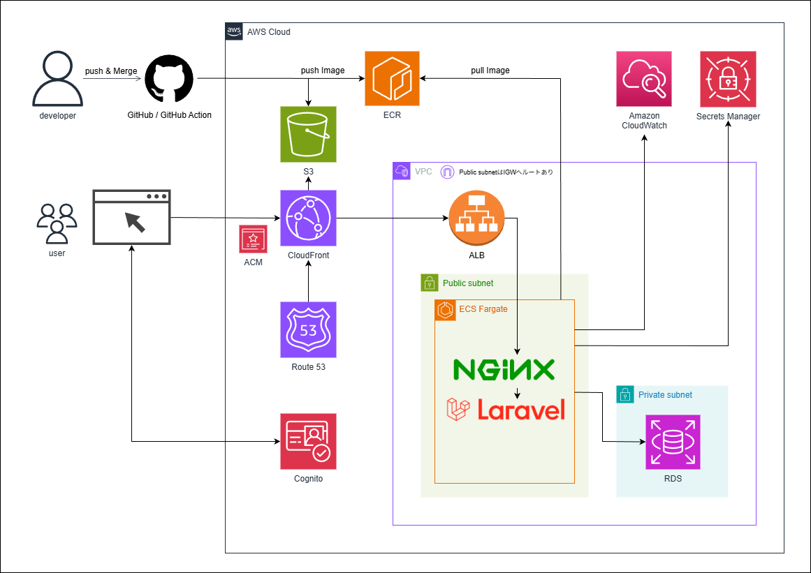
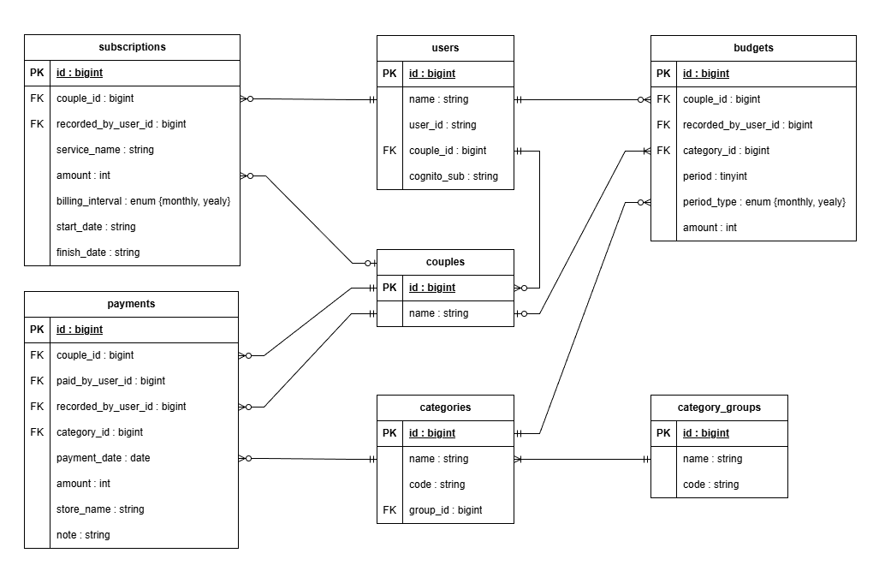
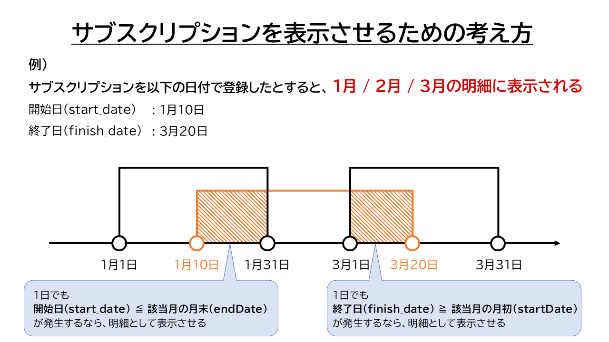

# 支出わけっと

スキル向上を目的に、家計管理アプリケーション **支出わけっと** を作成しました。

これはシングルページアプリケーション (`SPA`) として作成しており、以下の技術を採用しております。 
フロントエンド：**`TypeScript` / `Next.js`** 
バックエンド：**`PHP` / `Laravel`** 
インフラ：**`S3`+`CloudFront`（静的配信） / `ECS`（API ホスティング）** 

開発環境には `Docker` を用いており、フロントエンドとバックエンドを分離して開発を行っています。 
フロントエンド（`Next.js`）とバックエンド（`Laravel`）は `RESTful API` で連携し、それぞれ独立して開発・デプロイが可能な構成となっています。

---

### 二人の支払い分担・清算を簡単に

予算設定から実績管理、可視化まで一括で行える家計管理アプリケーションです。 
ユーザーモード（個人/共有）を切り替えることで、個人の家計とパートナーとの家計を柔軟に管理できます。

👩 家計簿をつけてはいるけど活用できていない 
🧑 恋人/夫婦の支払いの分担・清算に困っている 
こんな困りごとを解決するために作成したアプリケーションです。

サービス URL：https://waketto.com/

【 ゲストユーザーアカウント 】 
メールアドレス：waketto@sample.com 
パスワード：GuestAccount?1234

# 目次

1. [開発背景](#1-開発背景)
2. [機能一覧](#2-機能一覧)
3. [画面](#3-画面)
4. [技術スタック](#4-技術スタック)
5. [苦労した実装](#5-苦労した実装)
6. [今後の展望](#6-今後の展望)

## 1. 開発背景

私は社会人になってから、いくつもの家計簿アプリを使って家計管理を行ってきました。 
しかし、それらのアプリは主に個人の家計管理に特化しており、パートナーとの家計管理や精算の運用がしづらいと感じました。

### 課題 1：パートナーとの煩雑な精算処理

例えば

- 誰がいくら支払ったかを記録・可視化できない
- 個人用と共有用の家計を分けて管理できない

といった制約があり、パートナーと「どちらが何を支払ったか」を整理するのが大変でした。

私の場合は生活費はそれぞれが支払い、月末にレシートや記録を手作業で集計して精算しており、時間と手間がかかっていました。 
この作業は「入力」自体よりも、精算のために **支出を整理し直す工程** が重く、継続しづらいと感じていました。

### 課題 2：記録を活用できない家計簿アプリ

日々の支出を登録することで、合計の出費金額は確認できますが

- 使いすぎたかどうか
- 結果を踏まえて次月にどう活かすか

といった判断に使えませんでした。

この原因は、支出の記録が **予算** と **実績** で比較できないことだと考えました。

### 解決策: 統合型の家計管理アプリ

これらの課題を解決するため、以下の機能を持つアプリケーションを開発しました。

1. **精算を仕組み化する**

   - 家計を分けて管理: 個人用と共有用の家計を別で表示
   - 支払者を記録: 明細登録時に支払った人を登録
   - 精算まで自動化: 自動集計し、精算額を表示

2. **予算管理機能**: カテゴリー別に予算を設定し、実績と比較

ラクに効果的な家計管理を行える。 
そんな体験をユーザーに提供すべく、本 Web サービスを開発しました。

## 2. 機能一覧

- 認証

  - ログイン / ログアウト
    - `AWS Cognito` による認証
    - `JWT` トークンベース
    - トークンの自動リフレッシュ（セッション維持）
  - ユーザー登録
    - メールアドレスとパスワードで登録
    - 確認コードによるメールアドレス検証

- アカウント管理

  - ユーザー名の変更
  - パートナー連携 / 解除
  - パスワードの変更 / リセット
  - メールアドレスの変更
  - アカウント削除

- ユーザーモード切り替え

  - 個人モード
    - ログインユーザーが登録した明細のみ表示
  - 共有モード
    - ログインユーザーとそのパートナーが登録した明細が表示
    - 支払い担当者を記録し、分担を可視化

- 明細管理

  - 明細の登録 / 更新 / 削除
  - ファイナンスモード切り替えによる表示変更
  - 明細の表示（月次ビュー）

    - テーブル形式での明細一覧表示
    - カテゴリー別円グラフによる支出割合の可視化
    - 月間合計金額の表示

  - 明細の表示（年次ビュー）

    - カテゴリー別・月別の支出推移を棒グラフで可視

- 予算管理

  - カテゴリー別に予算の登録 / 更新
  - 月別予算消化状況の表示
  - 残予算の自動計算

- サブスクリプション管理

  - サブスクリプション登録 / 更新 / 削除
  - 登録したサブスクリプションを月次明細に自動反映

## 3. 画面

### 3-1.アカウント作成 / ログイン

#### アカウント作成

**機能**

- メールアドレス認証

  - アカウントの新規作成には「メールアドレス認証」を採用しました。 
    これにより不正にアカウントを作成することを防ぎ、セキュリティ面の向上を図りました。

- リアルタイムバリデーション

  - パスワードにはリアルタイムバリデーションを導入しました。 
    これによりパスワードの設定ルールをフォーム送信前にユーザーに伝えることができ、UX の向上を図りました。

#### ログイン方法

**機能**

- ログイン

  - 認証には `AWS Cognito` を採用しました。 
    これにより、セキュアな認証基盤を構築し、`JWT` トークンによる安全なセッション管理を実現しました。

### 3-2.支出管理 / 家計簿

#### 支出管理

**機能**

- 明細の登録

  - 登録した明細は、カテゴリーごとに分類されて支出管理表に表示されます。
  - 必須項目が未入力の場合は保存ボタンを無効化し、意図しないデータの送信を防いでいます。

- 明細の表示（月次ビュー）

  - 登録した明細をテーブル形式で一覧表示します。

- 明細の編集・削除

  - 支出管理表の明細をクリックすると編集モーダルが表示され、値の変更や削除を行うことができます。

- トーストを使った結果表示

  - 操作結果をトースト通知で表示し、時間経過で自動的に消えることで UX の向上を図りました。

#### 家計簿

**機能**

- 明細の表示（月次ビュー）

  - 登録した明細を、家計簿として可視化します。
  - カテゴリー別の円グラフで支出割合を視覚的に表示しています。

- 明細の表示（年次ビュー）

  - 月ごとにカテゴリー別で支出の推移を表示しています。
  - カテゴリー別・月別の支出推移を棒グラフで表示しています。 
    これにより、各カテゴリーの支出トレンドを一目で把握できます。

- 明細の登録・編集・削除

  - 支出管理と同じ明細操作をこのページでも行うことができます。

### 3-3.予算 / サブスクリプションの設定画面

#### 予算

**機能**

- 予算の登録・更新

  - カテゴリーごとに月間または年間の予算を設定することができます。
  - 登録した予算は支出管理表に表示され、予算額・支出額・残予算を一目で確認できます。

- 予算消化状況の表示

  - 年間予算を設定したカテゴリーについて、月別の予算消化状況を表示します。
  - 12 ヶ月分の支出推移を一覧で確認でき、年間の予算管理を効率的に行えます。

#### サブスクリプション

**機能**

- サブスクリプションの登録・更新・削除

  - サービス名称、更新間隔（月額 / 年額）、金額、契約期間（開始日 / 終了日）を設定できます。

- 支出管理への表示

  - 登録したサブスクリプションは、支出管理表と家計簿に自動的に明細として反映されます。
  - 年額の場合は月額換算（年額 ÷ 12）で表示されます。

### 3-4.アカウントの設定画面

ユーザー名変更 / ログイン情報変更 

パートナー設定 

**機能**

- ユーザー名の変更

  - 表示名を 10 文字以内で設定できます。

- パートナー連携

  - パートナーのユーザー ID を入力して連携できます。
  - 連携することでユーザーモードの切り替え（個人/共有）が可能になります。 
    共有モードでは、パートナーと明細を共有し、支払い分担を可視化できます。

- パートナー解除

  - パートナー連携を解除できます。 
    解除すると、共有モードで登録した予算・明細・サブスクリプションも削除されます。

- メールアドレス・パスワードの変更

  - `AWS Cognito` 経由でメールアドレスとパスワードを変更できます。

## 4. 技術スタック

### 4-1.使用技術

本プロジェクトを構成する、主要な技術を紹介します。
実務で広く使用されている技術を採用し、実践的なスキル習得を目指しました。

| カテゴリ           | 技術                                                                                                     |
| ------------------ | -------------------------------------------------------------------------------------------------------- |
| フロントエンド     | Next.js 15.5.2 / React 19.1.0 / TypeScript 5.9.2                                                         |
| バックエンド       | PHP 8.4 / Laravel 12.0                                                                                   |
| データベース       | MySQL 8.4                                                                                                |
| 認証               | AWS Cognito / AWS Amplify 6.15.6                                                                         |
| データフェッチング | SWR / Fetch API                                                                                          |
| 環境構築           | Docker / Docker Compose                                                                                  |
| インフラ           | S3 / CloudFront / ECR / ECS Fargate / VPC / RDS / ALB / Route 53 / ACM / CloudWatch / Systems Manager |
| UI/スタイリング    | shadcn/ui / Tailwind CSS                                                                                 |
| CI/CD              | GitHub Actions                                                                                           |
| コード品質         | ESLint / Prettier / PHPUnit / Laravel Pint                                                               |

#### 技術選定理由

**【フロントエンド】** 
本アプリは支出の登録 / 編集 / 削除を頻繁に行い、その結果を即座に複数の画面（支出管理・家計簿・推移）に反映させる必要があります。 
このようなリアルタイム性の高い UX を提供するためには、`SPA` が最適だと判断しました。 

`SPA` を実現するために、以下の理由から `React` と `Next.js` を採用しました。

- **`React`**
  - コンポーネントベースの設計により、支出入力フォームや予算設定など、繰り返し使用する UI パーツを効率的に開発・管理できます。
- **`Next.js`**
  - 静的エクスポート機能により、ビルド時に全ページを静的ファイルとして生成し、`S3` + `CloudFront` による高速配信を実現しました。 
    これにより初回ロード時間を短縮しつつ、クライアントサイドでのデータ取得により `SPA` のリアルタイム性も維持しています。 
    さらに、`App Router` により複数ページのルーティングを直感的に管理でき、開発効率が向上しました。

家計簿アプリでは、金額 / 日付 / カテゴリー / 明細 / 予算 / モードなど、多様で複雑なデータを扱います。 
これらのデータが正しい型で受け渡しされないと、計算ミスや表示エラーに繋がります。 

`TypeScript` を採用することで、開発段階でデータの型を厳密にチェックでき、予期せぬバグを未然に防ぐことができました。 
導入時は型の厳密さに苦しめられることもありましたが、支出管理と家計簿、予算と実績などの似た構造のデータを管理する際に 
安全にデータの受け渡しが行えるようになったことは大きなメリットでした。

**【バックエンド】** 
Laravel はルーティング、バリデーション、`ORM`（`Eloquent`）など Web アプリケーション開発に必要な機能が標準で揃っているため、 
効率的に開発を進められると判断し採用しました。

特に、本プロジェクトでは複数のテーブル（明細・予算・サブスクリプション）をリレーションしてデータを扱います。 
`Eloquent` を使用することで、これらのリレーションを直感的に定義 / 操作できたことは、開発効率の向上に大幅に役立ちました。

またバリデーション機能を活用することで、送信されるデータの整合性をバックエンドでもチェックすることができ、データの信頼性を確保できました。

**【データベース】** 
本番環境で `AWS RDS` を使用することを想定し、`MySQL` を採用しました。 
`Laravel` の `Eloquent ORM` との相性も良く、開発環境から本番環境まで一貫したデータベース環境を構築できました。

**【認証】** 
本アプリでは、ユーザーのパスワードなどの機密情報を運営者側で管理せず、 
セキュアな認証基盤を構築するため、`AWS Cognito` を採用しました。

`AWS Cognito` を使用することで、以下の 3 点を実現できました。

- `JWT` トークンによるステートレスな認証
- トークンの自動更新によるシームレスなセッション維持
- トークン期限切れ時の再ログイン促進

`AWS Amplify` ライブラリと組み合わせることで、
複雑な認証フローを少ないコードで実装できました。

**【データフェッチング】** 
本アプリでは、明細の登録・編集・削除を行った際に、 
支出管理表・家計簿・グラフなど複数の画面を即座に更新する必要があります。

`SWR` を採用することで、以下を実現できました。

- `API` から取得したデータを自動的にキャッシュし、複数の画面間でリアルタイムに同期
- データ更新後の自動再検証により、支出の登録・編集・削除を行った際に、関連する全ての画面（支出管理・家計簿・推移）に即座に反映
- キャッシュ機能により、2 回目以降のアクセスで高速表示

結果として、ユーザーにストレスのない快適な操作感を提供できました。

**【環境構築】** 
開発環境の統一と、実務で広く使われている技術の習得を目的に、 
`Docker` / `Docker Compose` を採用しました。

コンテナ化により、以下を実現できました。

- ローカル環境を汚さず、プロジェクトごとに独立した環境を構築
- 開発環境と本番環境（`ECS`）の差異を最小化
- チーム開発時の環境差異によるトラブルを防止

また、本番環境で `ECS Fargate` を使用することを想定し、 
早期から `Docker` に慣れておくことも目的の一つでした。

**【インフラ】** 
実務で広く使用されているクラウドインフラの構築を学ぶため、`AWS` を採用しました。

本プロジェクトでは、フロントエンド（`S3` + `CloudFront`）とバックエンド（`ECS Fargate`）を分離した構成を採用しています。

当初、フロントエンドも `ECS` で動かすことを検討しましたが、 
以下の理由から `S3` + `CloudFront` の構成を選択しました。

- `CloudFront` のオリジン設定で、パスベースのルーティングを簡単に実現
  - `/api/*` → `ALB`（バックエンド）
  - その他 → `S3`（フロントエンド）
- `Nginx` の設定が不要になり、構成がシンプルに
- `CDN` による高速配信とコスト削減も実現

また、`RDS`（`MySQL`）/ `VPC` / `ALB` / `Route 53` / `ACM` など、
実務で使用される標準的なサービスを組み合わせ、スケーラブルなインフラを構築しました。

**【UI/スタイリング】** 
スタイルの一貫性と保守性を確保するため、`Tailwind CSS` と `shadcn/ui` を組み合わせて採用しました。 
`shadcn/ui` は `Tailwind CSS` ベースのため、同じデザインシステムで統一して使えます。 
コピー&ペーストで組み込める再利用可能なコンポーネントにより、ボタン・フォーム・ダイアログなどを素早く実装でき、開発効率が向上しました。

**【CI/CD】** 
デプロイの自動化により開発効率を向上させるため、`GitHub Actions` を採用しました。

`main` ブランチへのマージをトリガーに、`AWS`（`ECR` / `ECS` / `S3`）への自動デプロイが実行されます。 
これにより、手動デプロイのミスを防ぎ、本番環境への反映を迅速に行うことができました。

**【コード品質】** 
技術負債を防ぎ、保守性の高いコードを維持するため、 
プロジェクト立ち上げ時から厳格なコード品質管理を導入しました。

フロントエンドには `ESLint` / `Prettier`、バックエンドには `Laravel Pint` を採用し、 
コーディング規約を統一しました。

また、`GitHub Actions` により、Pull Request 時に自動的にコードチェックを実行し、 
品質基準を満たさないコードはマージできない仕組みを構築しました。

### 4-2.データベース設計（ER 図）

### 4-3.インフラ構成図

## 5. 苦労した実装

Web アプリを実装するにあたり、以下の実装にこだわって作成しました。

- `JWT` トークンによるセキュアな認証
- モード（ユーザー / ファイナンス）の切替と更新
- サブスクリプションの明細反映

### JWT トークンによるセキュアな認証

本サービスの開発を開始するまでは、セッションベースの認証を学んできました。 
ですが、`AWS Cognito` は `JWT` トークンを使う認証方式のため、セッションベースとは異なるアプローチが必要でした。

フロントエンドとバックエンドで適切に連携する仕組みを構築し、ステートレスな認証を実現するため 
特に以下の 3 点に苦労しました。

**① JWT の仕組み理解**

`JWT` トークンを使った認証の仕組みや改ざん検証、有効期限チェックのロジックが分からず、知識の習得から開始しました。 

調べていく中で、`AWS Cognito` からは 3 種類のトークン（`IDToken`、`AccessToken`、`RefreshToken`）が発行されることを知りました。 
`API` 認証には`AccessToken`を使う必要があると理解し、その`AccessToken`が `JWT` 形式であることを把握しました。 
`JWT` の構造（`header.payload.signature`）と、ヘッダーから `kid`（Key ID）を取得して 
`Cognito` の公開鍵（`JWKS`）で改ざん検証を行う仕組みを理解できたことで、実装の方針が見えてきました。

- フロントエンド
  - `AWS Amplify` v6
- バックエンド
  - カスタムミドルウェア `CognitoJwtAuth` を作成
  - リクエストヘッダーの `Authorization` から `Bearer` トークン（`AccessToken`）を抽出して検証する

**② フロントエンドとバックエンドの使い分け**

最初はフロントエンドで認証した結果をバックエンドにも渡す、統一的な実装を想定していました。 
ですが、開発を進める中で『1 度ログインした後は 有効期限の検証ができない』など 
致命的な欠陥が存在していることに気が付きました。

そこで改めて `AWS Cognito` の使われ方を調べる中で、フロントエンドとバックエンドで役割を分ける手法に気が付きました。 
具体的には以下の構成にすることで、各通信に強固なセキュリティを提供できるようになりました。

- フロントエンド：`AWS Amplify` で `AWS Cognito` との認証とトークン管理
- バックエンド：自作ミドルウェアで `JWT` トークンの検証を行う

**③ Amplify を使った実装**

フロントエンドで `AWS Amplify` を使った実装に手間取りました。

最初はネット上の記事や生成 AI が出力するコードを参考に実装を進めましたが 
メソッドが見つからずエラーが発生しました。
原因を調べると、`Amplify` v5 と v6 で `API` が大きく変わっていることが判明しました。

本プロジェクトでは v6 をインストールしているのに、参考にした情報では v5 の実装方法が載っている。 
この違いが、うまくいかない原因でした。

そこから、公式ドキュメントを確認し、v6 の実装方法を正しく実装することで、 
フロントエンドでも動作させることができました。

■ 参考ファイル 
`backend/app/Http/Middleware/CognitoJwtAuth.php`

### モード（ユーザー / ファイナンス）の切替と更新

本サービスでは、以下 2 つのモードを切り替えることで、最大 4 種類のデータを表示することができます。

- ユーザーモード

  - 個人と共有
  - それぞれで別の支出を管理できる

- ファイナンスモード

  - 支出管理と家計簿
  - 異なる視点で支出を管理できる

そして UX を向上させるために、それぞれを表示させるためにページ遷移を使いたくないと考えていました。

そこで、パラメータに現在のモード（`userMode`）を加えることで、バックエンドで取得するデータを変更する方法を考えました。

しかし データの切り替えを実現するにあたり、 
通常の `GET` リクエストでは 以下の点でコードが複雑になり 保守性が低下すると感じていました。

- モード切替時に、各画面でデータ再取得の処理を個別に実装する必要がある
- 支出に変更が生じた際、複数のコンポーネント（支出管理 / 家計簿 / 予算消化状況など）を個別に更新する必要がある

そんな中、`SWR` という`mutate`を使用して関連データを自動的に再取得してくれるライブラリを知り、「これだ」と思いました。

- `SWR` のカスタムフック（`useExpenseReport`、`useBudgetUsage` など）でキャッシュキーに `userMode` を含める 
  その結果、モードごとにデータを管理できるようになった
- モード切替時には、`ViewModeContext` 内で `userMode` を更新する 
  キャッシュキーに `userMode` が含まれているため、モードが変わることで関連する全てのデータが自動的に再取得される
- 明細の登録・編集・削除が成功すると、関連する複数の `mutate` 関数を実行する 
  その結果、支出管理表・家計簿・予算消化状況など複数の画面が自動的に更新される

この方法を使うことで、簡潔にコードを保ちつつ、モードの切り替えを実装できました。 
`SWR` にはデメリット（メモリ使用量の増加など）もありますが、本アプリの要件では許容できると判断し採用しました。

### サブスクリプションの明細反映

サブスクリプション（定額支払い）は家計管理の中でも見落としやすく、継続的に把握できる形で扱う必要があります。 
実装では「どう保存し、どのように画面に表示するか」について悩みました。

**① 保存・表示方式の検討**

最初は各月ごとに `payment` テーブルにレコードを作成する方法を考えました。 
ただしこの方法では 開始〜終了の期間が長期にわたるサブスクほどレコードが増え、以下の問題が発生すると考えました。

- 途中で金額や期間を変更する際、更新対象が多くなり処理が重くなる
- データ量が増え、データベースの管理コストが上がる

そこで方針を切り替え、レコードは作成せずに表示時にサブスクを差し込む方法を検討しました。

実際に採用した構成は以下の通りです。

- サブスクリプション専用のテーブルを用意して、契約情報（金額・期間など）だけを保存する
- 表示時に対象のデータを`payment`形式に変換して追加する

この構成により、`payment`テーブルの肥大化を避けつつ、支出と同じ形でサブスクを表示させることができるようになりました。

**② 表示対象の判定（期間の重なり）**

サブスクリプションは単発の支出明細と異なり、**開始日〜終了日の期間**で登録されます。 
そのため『表示する月に含めるべきか』を判定するロジックの作成に苦労しました。

最終的には、表示する月の期間を

- `startDate`：月初
- `endDate`：月末

として取得し、次の条件を満たすサブスクのみを取得するようにしました。

- `start_date <= endDate`
- `finish_date >= startDate`

この条件により、対象月とサブスク期間が 1 日でも重なっていれば表示する挙動を実現でき、 
月跨ぎや途中開始 / 終了のケースも漏れなく扱えるようになりました。

■ 参考ファイル 
`backend/app/Traits/ReportDataTrait.php` 
`backend/app/Http/Controllers/Api/ExpenseReportController.php` 
`backend/app/Http/Controllers/Api/HouseholdReportController.php` 

## 6. 今後の展望

以下の機能の実装を予定しています。

- Google アカウントを使った認証機能
- 明細の自動取得
  - カードと連携し明細を自動取得
  - 取得した明細はカテゴリーのみ入力していない状態で、振り分け前の項目に設置する
- スマホに特化した UI 開発
  - 支出登録画面を右下に常時表示させる
  - 画面下部にナビゲーションを用意する
- カテゴリーのカスタマイズ機能
  - カテゴリーの色分けをユーザーごとに設定できる
  - 浪費・投資の項目のみカテゴリの追加可能
- 支出のカレンダー表記機能
  - 家計簿モードの円グラフの下のスペースを使って実装予定
